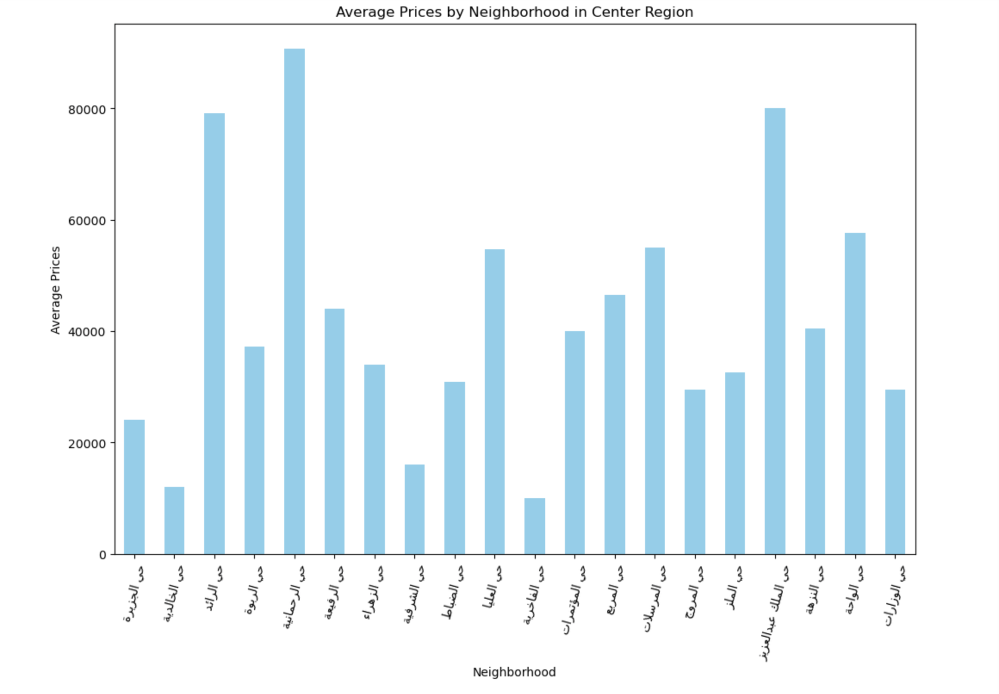
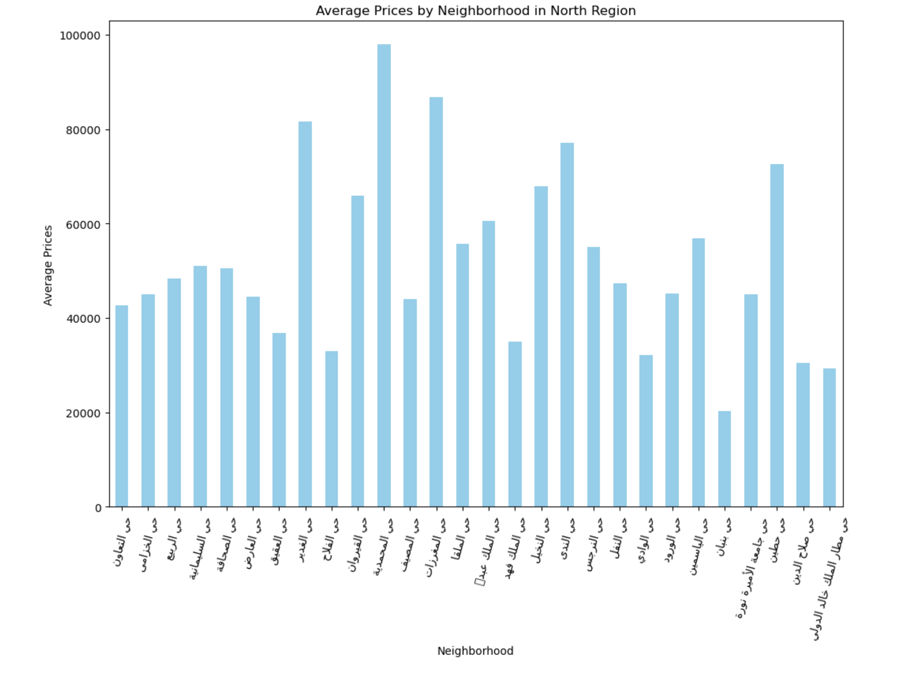
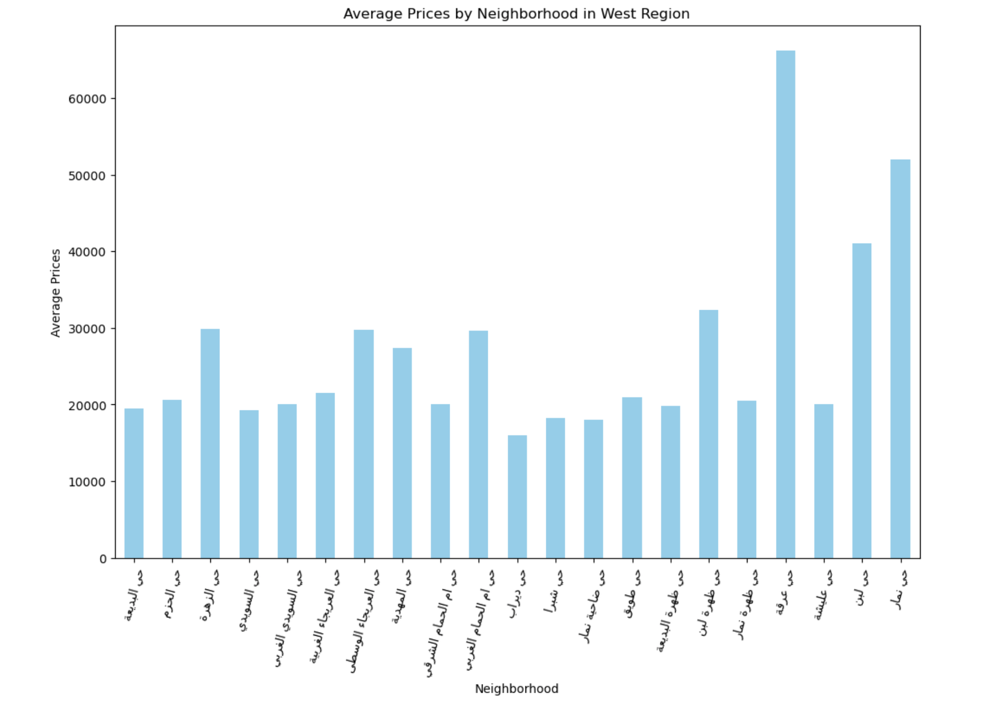
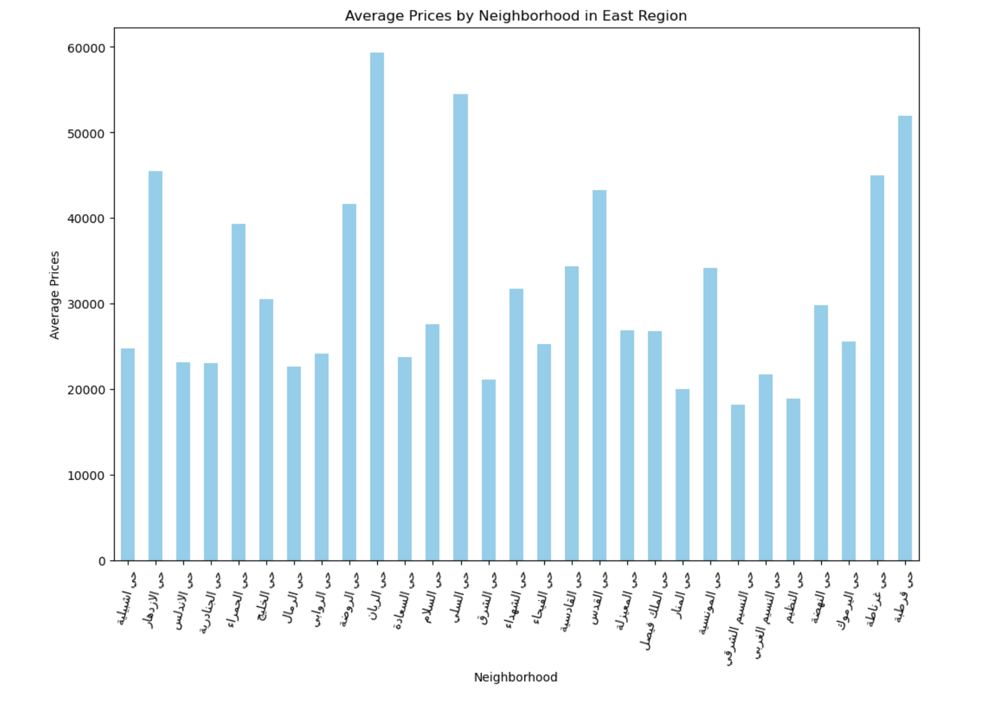
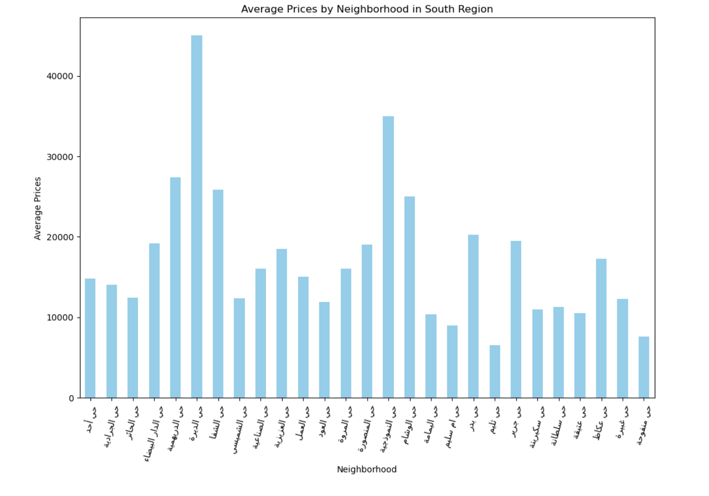

# Usecase-6-Project-3

This project is about Data Storytelling, an interactive streamlit story about an apartments dataset from the website https://sa.aqar.fm/

Streamlit link: https://usecase6.streamlit.app/

## Data Cleaning steps:

### 1.  Reliability

-   The dataset was scrapped from a website called Aqar in 2022.
-   Apartments: [https://sa.aqar.fm/شقق-للإيجار](https://sa.aqar.fm/%D8%B4%D9%82%D9%82-%D9%84%D9%84%D8%A5%D9%8A%D8%AC%D8%A7%D8%B1)
-   Licensed by: Real Estate General Authority

### 2.  Timeliness

-   The data is from the year 2022, due to the data being public and not downloadable from the source, we will continue using it.

### 3.  Consistency
 
-   The dataset has some inconsistencies in the 'UserName' column where some names were unclear.
-   A column named 'refresh' that had the same values as a column named 'last_update'.
-   Columns names followed a mix of naming styles.
-   Some column names meaning is vague like 'beds' when they meant bedrooms for example.
-   The 'area' column had values that were too little or illogically big, making no sense.

### 4.  Relevance

-   The dataset was relevant to the questions we asked.
-   Sample Appropriateness was good, our target was apartments and it covered that.
-   Variable Selections "after renaming":
    
|    |    |
|--|--|    
| user_id | id |
| price | bedrooms |
| living_rooms | bathroom |
| area | street_width |
| age | last_update |
| kitchen | air_conditioning |
| furnished | district |
| create_time | review |
| seller | verified |
| days_on_market | available_for_rent |
| longitude | latitude |
| Region | -

The remaining columns were dropped because they were unusable or irrelevant to our analysis.

### 5.  Uniqueness
    
-   No duplicates were found.
    
### 6.  Completeness

-   The dataset had about 5% of missing values, 9734 to be exact.
-   Dealing with columns affected with null:
                        
| Column | Missing | Filled with |
|--|--|--|
| content | - | Dropped for irrelevancy. |
| imgs | - | Dropped for irrelevancy. |
| area | Missing 175, Missing (%) 2.6%, | filled with zeros as there is no way to tell how much. |
| street_width | Missing 210, Missing (%) 3.1% | filled with zeros as there is no way to tell how much. |
| furnished | Missing 45, Missing (%) 0.7% | filled with zeros as the zeros of this column is 91% more than the value 1. |
| UserName | Missing 93, Missing (%) 1.4% | filled with 'unknown'. |
| iam_verified | Missing 146, Missing (%) 2.2% | filled with 0 as it represented unverified status. |
| livings | Missing 2, Missing (%) < 0.1% | filled with 0 as there is no way to tell. |
| kitchen | Missing 17, Missing (%) 0.3% | filled with 1 as the value 1 was dominant in the column by 86% |
| ac | Missing 17, Missing (%) 0.3% | filled with 1 as the value 1 was dominant in the column by 86%. |
| age | Missing 705, Missing (%) 10.4% | filled with the median of the column to preserve the distribution of the data. |

### 7.  Accuracy
Data types changed to a more logical approach:

| Column name | To type |
|--|--|
| Last_update  | datetime |
| create_time  | datetime |
| Kitchen | boolean |
| air_conditioning | boolean |
| furnished | boolean |
| verified | boolean |
| available_for_rent  | boolean |
| Living_rooms  | int |

## Insights: 

1. The pie chart shows that the North region leads in real estate offers with 53%, followed by the East at 32.8%. The West and South have much smaller shares at 7.8% and 3.7%, respectively, while the Center region has the least activity with only 2.7%. This suggests that the North and East are the most active areas for property listings.

2. The bar chart shows the average property prices across different regions. The North region stands out with the highest average price, significantly above the others. The Center, East, and West regions show moderate average prices, while the South region has the lowest average price. This suggests that properties in the North are generally more expensive compared to other regions.

3. The bar chart displays the average property prices for the top 10 neighborhoods. It shows that the neighborhood on the far left has the highest average price, followed  by the second neighborhood. The remaining neighborhoods have slightly lower but relatively similar average prices. 

4. prices across neighborhoods:

   
- center:The bar chart shows wide variation in average property prices across neighborhoods in the Center region, with some areas significantly more expensive than others. A few neighborhoods exceed 80,000, highlighting a diverse range of property values in this region.

- North: The bar chart shows the average property prices across neighborhoods in the North region, with noticeable variations. Some neighborhoods reach average prices over 100,000, while others are significantly lower. This indicates a wide range of property values within the North region.

- West: The bar chart highlights the average property prices across neighborhoods in the West region. There's a noticeable spike in one neighborhood, which significantly surpasses the others in price. Most other neighborhoods have moderate average prices, indicating a mix of property values.

- East: The bar chart displays the average property prices across neighborhoods in the East region. There is considerable variation in prices, with some neighborhoods reaching high averages while others remain much lower. This indicates a diverse property market in the East, with certain areas commanding higher prices, likely due to factors such as location or amenities.

- South: The bar chart illustrates the average property prices across neighborhoods in the South region. The data shows significant variability, with some neighborhoods reaching higher averages while others remain much lower. This suggests that the South region has a mix of more and less expensive neighborhoods, contributing to a diverse property market.

## Team Members

- Abdulaziz Al Kathiri
- Raghad Al Malki
- Alaa Al Ahmadi
- Wadia 
- Salman Gassem
